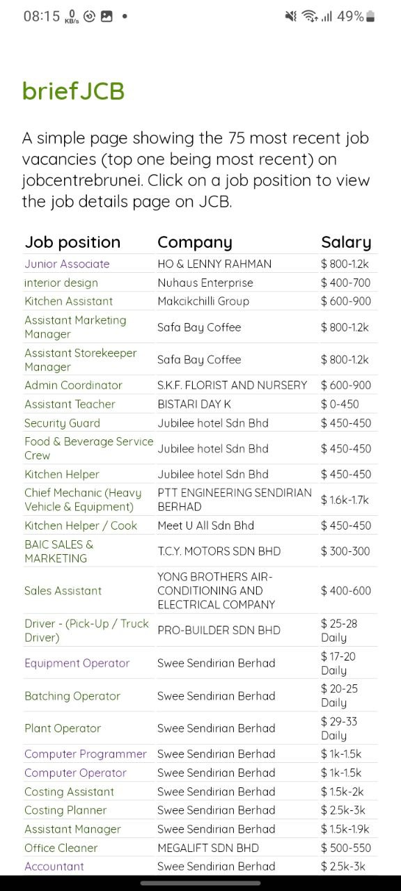

# briefJCB
## This app displays a compact view of all job vacancies on jobcentrebrunei. 

### To-do:
- ~~Make it installable on android/iOS~~
- ~~Add links to jcb page for each job~~
- ~~Search for keywords (job position and company)~~
- ~~Remove repetitive "Monthly"~~
- ~~Responsive font size for mobile and desktop~~
- ~~Render error page when jobcentre is down or under maintenance~~
- ~~Light/Dark theme based on device/browser theme~~
- Fix icon background on ios home screen shortcut
- Notify new jobs every interval (daily / weekly)
- Store all previous jobs in a db and allow users to view them in another page
- Only re-render table when switching pages
- Include closing date and employment type for each job
